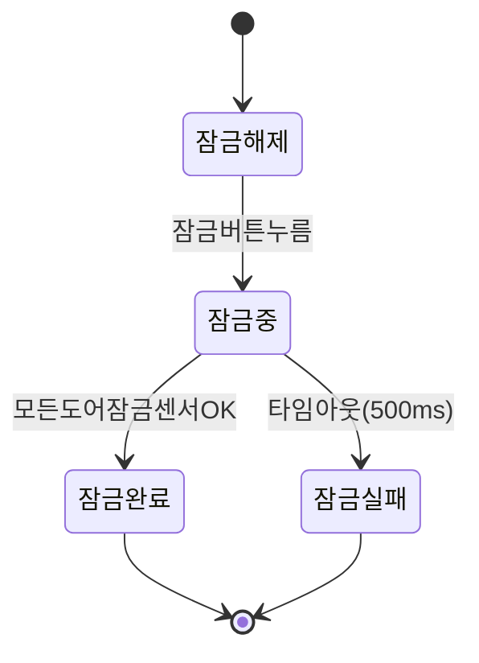
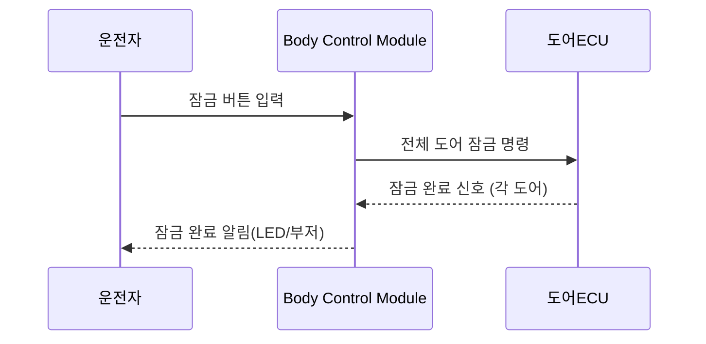

# 기능 요구사항의 UML/SysML 표현

기능 요구사항은 문장만으로는 상호작용, 상태 전이, 시스템 경계를 놓치기 쉽습니다. 요구사항의 성격에 맞는 다이어그램 하나를 반드시 함께 만드세요 — "다이어그램은 나중에"는 이 스킬에서 허용하지 않습니다.

## 어떤 다이어그램을 쓸지 선택하는 기준

| 요구사항 성격 | 다이어그램 |
|---|---|
| 시스템/구성요소와 외부 행위자(사용자, 다른 시스템)의 상호작용 범위 | 유스케이스 다이어그램 |
| 특정 트리거에 대한 여러 구성요소 간 메시지/신호 순서 | 시퀀스 다이어그램 |
| 상태에 따라 달라지는 동작(EARS의 WHILE 패턴과 자연스럽게 대응) | 상태 머신 다이어그램 |
| 여러 단계로 이어지는 처리 흐름/로직 | 액티비티 다이어그램 |
| 시스템 구조(블록, 포트, 인터페이스) | SysML 블록 정의 다이어그램(BDD) / 내부 블록 다이어그램(IBD) |
| 요구사항 간 파생·만족·검증 관계 자체를 시각화 | SysML 요구사항 다이어그램(Requirement Diagram) |

## 표현 방식: Mermaid 우선, SysML 전용 요소는 PlantUML

이 저장소는 GitHub에 푸시되므로, GitHub가 마크다운에서 네이티브로 렌더링하는 **Mermaid**를 기본으로 사용합니다. 유스케이스는 Mermaid에 전용 다이어그램 타입이 없으므로 흐름(flowchart)으로 근사해서 표현합니다.

- 유스케이스 → `flowchart` (행위자를 노드로, 시스템 경계를 subgraph로 표현)
- 시퀀스 → `sequenceDiagram`
- 상태 머신 → `stateDiagram-v2`
- 액티비티 → `flowchart` (TD/LR 방향의 순서도로 표현)

SysML 고유 다이어그램(블록 정의 다이어그램, 요구사항 다이어그램)은 Mermaid가 지원하지 않으므로 **PlantUML**(`!include <sysml/...>` 스테레오타입 또는 `<<block>>`, `<<requirement>>` 스테레오타입을 수동 표기)을 사용합니다. PlantUML은 GitHub에서 자동 렌더링되지 않으므로, 코드 블록 위에 "PlantUML 렌더러(예: VS Code 확장, plantuml.com)로 확인 필요"라고 명시하세요.

## 예시

### 상태 머신 다이어그램 (Mermaid)



### 시퀀스 다이어그램 (Mermaid)



### SysML 요구사항 다이어그램 (PlantUML — 별도 렌더러 필요)

```plantuml
@startuml
!include <sysml/sysml>

requirement "SYS-REQ-0012" as R1 {
  text = "WHEN 잠금 버튼이 눌리면 THE 도어 잠금 시스템 SHALL 0.5초 이내에 모든 도어를 잠근다"
}
requirement "STK-REQ-0003" as R0 {
  text = "사용자는 버튼 한 번으로 전체 도어를 잠글 수 있어야 한다"
}
testCase "TC-0045" as T1

R0 <- R1 : deriveReqt
T1 .> R1 : verify
@enduml
```

## 다이어그램과 추적성의 연결

SysML 요구사항 다이어그램의 `deriveReqt`(파생), `satisfy`(설계요소가 요구사항을 만족), `verify`(테스트케이스가 요구사항을 검증), `refine`(구체화) 관계는 `references/traceability.md`의 매트릭스와 같은 정보를 그림으로 표현한 것입니다. 요구사항 개수가 적을 때는 다이어그램만으로도 충분하지만, 개수가 늘어나면 반드시 매트릭스(표)로도 유지하세요 — 다이어그램은 사람이 보기 위한 것이고, 매트릭스는 빠짐없이 점검하기 위한 것입니다. 둘 중 하나만 갱신하고 다른 하나를 방치하지 마세요.
