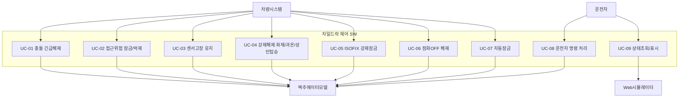

# ENG-SWE1-002_Use Case 명세서

| 필드 | 값 |
|---|---|
| 템플릿 ID | TPL-SWE1-002 |
| 적용 프로세스 | SWE.1 |
| 프로젝트 | VJ-ECL-2026 (전자식 차일드락 제어 SW) |
| 작성 문서 ID와 명칭 | ENG-SWE1-002_Use Case 명세서 |
| 버전 및 베이스라인 | v0.1 (draft) — 목표 베이스라인 BL-SWR-1.0 (G1) |
| 관련 문서 | `ENG-SWE1-001_SW 요구사항 명세서` |
| 상태 | 초안 — Phase 1 리뷰 대기 |

> 교육용 가상 프로젝트(VJ-ECL-2026) 산출물. 형식은 초안 단계(Markdown)이며, 베이스라인 확정 시 `docx`/`drawio` 스킬로 `TPL-SWE1-002`/`TPL-SWE1-003` 실제 양식에 전사한다.

---

## 1. 목적 및 적용범위

`ENG-SWE1-001`의 기능 요구사항을 시나리오(행위자-시스템 상호작용) 관점으로 재구성해, 기본/대안/예외 흐름과 사후조건을 명시한다. 적용범위·경계는 `ENG-SWE1-001` §1과 동일하다.

---

## 2. 액터와 시스템 경계

| 액터 | 역할 |
|---|---|
| 운전자 | 물리버튼/AVN/음성/모바일앱으로 잠금·해제 명령 입력 |
| 차량 시스템 | 속도, 기어, 충돌상태, 접근위험, 화재/과온/성인탑승, ISOFIX, 점화, 센서고장 신호 제공(OEM-IF-001~003, 007~009) |
| 차일드락 제어 SW (대상 시스템) | 판정 로직, 상태 관리, 출력 생성 |
| 액추에이터 모델 | 좌/우 LOCK/RELEASE 출력 소비(OEM-IF-005) — PC/SIL 논리 모델 |
| 표시/조작 클라이언트 (Web 시뮬레이터) | 상태조회, 시험 입력 주입, 결과 가시화(OEM-IF-006) |

시스템 경계: 대상 시스템은 판정 로직·상태·이벤트 생성까지이며, 도어 래치/구동기 HW, CAN/LIN 드라이버, 센서 성능·진단 설계는 경계 밖(공급자 SW 범위 밖, `ENG-SWE1-001` §10).

---

## 3. Use Case 목록

| UC ID | 명칭 | 목적 | 주 액터 | 관련 SWR | 우선순위 | 상세 절 작성 상태 |
|---|---|---|---|---|---|---|
| UC-01 | 충돌 긴급해제 | 충돌 확정 시 최우선 해제 | 차량 시스템 | SWR-007, 008 | 필수 | 완결(§4.1) |
| UC-02 | 접근위험 잠금/억제 | 후측방 위험 시 잠금 유지 및 재입력 예외 | 차량 시스템, 운전자 | SWR-005, 006, 009 | 필수 | 완결(§4.2) |
| UC-03 | 센서고장 유지 | 입력 신뢰불가 시 마지막 출력 고정 | 차량 시스템 | SWR-021 | 필수 | 완결(§4.3) |
| UC-04 | 강제해제(화재/과온/성인탑승) | 인명 위험 시 강제 해제 | 차량 시스템 | SWR-017 | 필수 | Phase 3에서 상세화 |
| UC-05 | ISOFIX 강제잠금 | 카시트 고정 시 강제 잠금 | 차량 시스템 | SWR-018 | 필수 | Phase 3에서 상세화 |
| UC-06 | 점화OFF 해제 | 시동 꺼짐 시 초기 해제 | 차량 시스템 | SWR-020 | 필수 | Phase 3에서 상세화 |
| UC-07 | 자동잠금 | 주행 시작 시 자동 잠금 | 차량 시스템 | SWR-003 | 필수 | Phase 4에서 상세화 |
| UC-08 | 운전자 명령 처리 | 4-source 명령 적용 | 운전자 | SWR-001, 002, 004, 006 | 필수 | 완결(§4.4, 재입력 오버라이드 포함) |
| UC-09 | 상태조회/표시 | 현재 상태·이유 코드 표시 | 운전자, Web 시뮬레이터 | SWR-014, 015 | 필수 | 완결(§4.5) |

UC-04~07은 Phase 1에서는 목록·경계만 확정하고, 해당 phase(3/4) 실행 시 §4에 상세 절을 추가한다 — 이는 계획서(작업 계획)의 phase별 점증 원칙과 정합하며, 임의 생략이 아니라 phase 배정에 따른 것임을 §5(비대상 시나리오)와 구분해 명시한다.

---

## 4. Use Case 상세

### 4.1 UC-01 충돌 긴급해제

- **기본 정보**: ID UC-01 / 주 액터 차량 시스템 / 관련 SWR SWR-007, SWR-008 / 이해관계자: 탑승 아동(안전), OEM 안전 담당.
- **사전조건**: SW가 정상 평가주기로 동작 중. **트리거**: crash_status가 PENDING/NONE→CONFIRMED로 전이.
- **기본 흐름**:
  1. 차량 시스템이 crash_status=CONFIRMED를 제공한다.
  2. SW가 §4.2 우선순위표 순위1을 판정한다(다른 모든 조건 무시).
  3. SW가 좌·우 출력을 RELEASE로 설정한다(300ms 이내).
  4. SW가 이후 입력 주기에도 RELEASE를 유지한다.
- **대안 흐름**: crash_status=PENDING인 동안은 UC-01이 발동하지 않고 §4.2 우선순위표의 다른 UC가 정상 적용된다(UC-02 참고, §8 가정 A-2).
- **예외 흐름**: crash 신호 자체가 stale/형식오류이면(SWR-013) DEGRADED로 전이하고 UC-01을 발동하지 않는다 — 이 경우 안전 담당에게 알리는 것이 상위 시스템(차량) 책임이며 이 SW 범위 밖.
- **사후조건**: 좌·우 state=RELEASE, 우선순위 사유코드 기록. crash_status가 CONFIRMED로 유지되는 한 다른 어떤 입력도 이 상태를 되돌리지 못한다.

### 4.2 UC-02 접근위험 잠금/억제 (+ 재입력 오버라이드)

- **기본 정보**: ID UC-02 / 주 액터 차량 시스템, 운전자 / 관련 SWR SWR-005, 006, 009.
- **사전조건**: UC-01 미발동(§4.2 우선순위표 순위1,2 아님). **트리거**: 도어 D의 approach_risk가 TRUE.
- **기본 흐름**:
  1. 차량 시스템이 도어 D의 approach_risk=TRUE를 제공한다.
  2. SW가 도어 D를 LOCK, 억제 사유를 기록한다.
  3. 운전자가 도어 D에 RELEASE를 요청하면 SW가 거부하고 LOCK을 유지한다.
- **대안 흐름 (오버라이드)**: 억제 발생 후 10초 이내에 같은 RELEASE가 재입력되면 SW가 override로 처리해 RELEASE를 허용하고 override 사유를 기록한다(UC-08과 교차).
- **예외 흐름**: approach_risk 입력이 stale/형식오류이면 SWR-013에 따라 DEGRADED, UC-02는 그 입력을 신뢰하지 않는다.
- **사후조건**: 도어 D는 approach_risk가 TRUE인 한 LOCK 유지(오버라이드 예외 제외), 반대쪽 도어 출력 불변(SWR-009).

### 4.3 UC-03 센서고장 유지

- **기본 정보**: ID UC-03 / 주 액터 차량 시스템 / 관련 SWR SWR-021.
- **사전조건**: UC-01 미발동(§4.2 우선순위표 순위1 아님, §8 가정 A-1). **트리거**: 정규화 입력의 sensor_fault=TRUE.
- **기본 흐름**:
  1. SW가 sensor_fault=TRUE를 확인한다.
  2. SW가 새 명령을 적용하지 않고 직전 확정 좌·우 출력을 유지한다.
  3. SW가 state=FAULT, 경고코드를 생성한다.
- **대안 흐름**: 없음(고장 유지가 유일한 대응).
- **예외 흐름**: sensor_fault 신호 자체가 무효면 SWR-013에 따라 별도 DEGRADED 처리(고장 신호를 신뢰할 수 없는 재귀적 상황 — 아키텍처 단계에서 이 조합을 별도 검토 필요, §8에 추가 예정).
- **사후조건**: 좌·우 출력이 고장 발생 직전 값으로 고정, state=FAULT 유지, crash_status=CONFIRMED 전이 시에만 UC-01로 대체.

### 4.4 UC-08 운전자 명령 처리

- **기본 정보**: ID UC-08 / 주 액터 운전자 / 관련 SWR SWR-001, 002, 004, 006.
- **사전조건**: §4.2 우선순위표 순위1~7 모두 미해당(해당 도어). **트리거**: 4-source(물리버튼/AVN/음성/모바일앱) 중 하나에서 (side, action) 명령 수신.
- **기본 흐름**:
  1. 운전자가 명령을 입력한다.
  2. SW가 side를 left/right/all로 해석해 대상 도어를 결정한다(SWR-002).
  3. 상위 우선순위 조건에 해당하지 않으면 SW가 action(LOCK/RELEASE)을 대상 도어에 적용한다.
- **대안 흐름**: RELEASE 명령이 접근위험 억제 중인 도어에 대한 것이면 UC-02의 오버라이드 조건(10초)으로 분기한다.
- **예외 흐름**: 명령의 side/action/source가 미등록 enum이거나 누락이면 SW가 거절한다(OEM-IF-004).
- **사후조건**: 대상 도어(들) 출력이 명령대로 갱신되거나, 상위 우선순위/오버라이드 조건에 따라 거부·대체된다.

### 4.5 UC-09 상태조회/표시

- **기본 정보**: ID UC-09 / 주 액터 운전자, Web 시뮬레이터 / 관련 SWR SWR-014, 015.
- **사전조건**: 없음(항시 응답 가능). **트리거**: 상태조회 요청.
- **기본 흐름**:
  1. 요청자가 상태조회를 호출한다.
  2. SW가 좌·우 출력, state, 입력 유효성, 최근 이유코드를 OEM-IF-006 계약으로 직렬화해 응답한다.
- **대안 흐름**: 없음.
- **예외 흐름**: 직렬화 실패 시 HTTP 500을 반환한다.
- **사후조건**: 응답 시점의 시스템 상태가 변경되지 않는다(조회는 부작용 없음).

---

## 5. 비대상 시나리오

- HIL/실차 환경에서의 액추에이터 물리 동작 확인 — SW-only PC/SIL 경계 밖.
- 모바일 앱/음성 자체의 사용자 인터페이스 품질(UX) 평가 — 이 SW는 4-source 명령의 "수신·적용"만 다루고 각 채널의 UI/UX는 범위 밖.
- 대한민국 법규(별표14/14의2) 적합성 판정 시나리오 — `ENG-SWE1-001` §10과 동일 경계.

---

## 6. 추적성

각 UC의 "관련 SWR" 열(§3)이 `ENG-SWE1-001` §11 매트릭스와 연결된다. UC 단위 설계/검증 산출물 ID는 해당 UC가 속한 phase(§3 "상세 절 작성 상태" 참고)의 아키텍처/시험 산출물이 확정되는 시점에 이 표에 추가한다.

---

## 7. 참고자료

- `ENG-SWE1-001_SW 요구사항 명세서` (같은 버전)
- `OEM_Sample/OEM-SWR-001_OEM SW 요구사항 사양서.docx`
