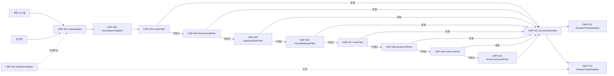
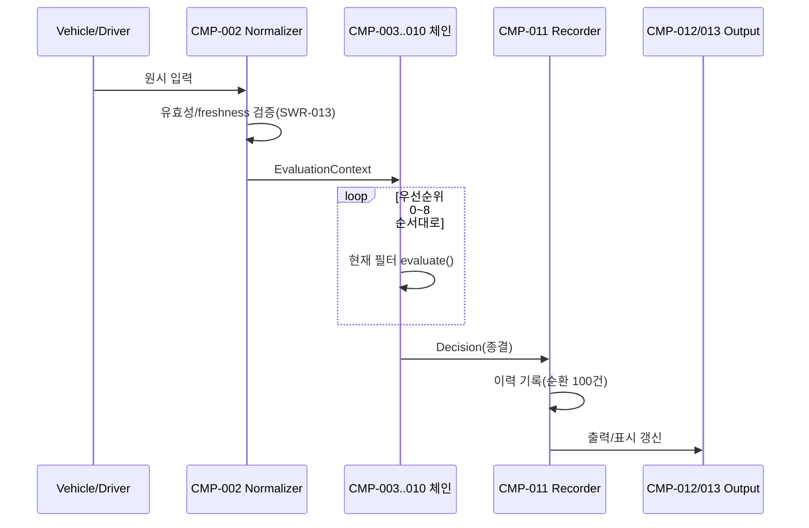
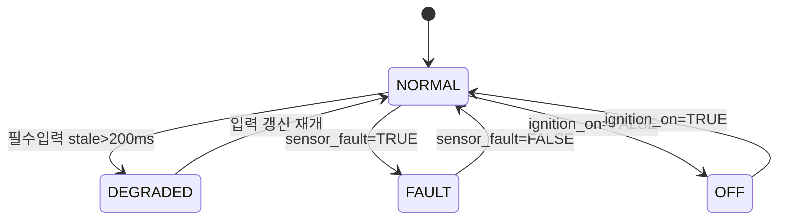

# ENG-SWE2-001_SW 아키텍처 설계서

| 필드 | 값 |
|---|---|
| 템플릿 ID | TPL-SWE2-001 |
| 적용 프로세스 | SWE.2 |
| 프로젝트 | VJ-ECL-2026 (전자식 차일드락 제어 SW) |
| 버전 및 베이스라인 | v0.1 (draft) — 목표 베이스라인 BL-SWA-1.0 (G2) |
| 상위 입력 | `ENG-SWE1-001_SW 요구사항 명세서` v0.1, `ENG-SWE1-002_Use Case 명세서` v0.1 |
| 상태 | 초안 — Phase 1 리뷰 대기 |

> 교육용 가상 프로젝트(VJ-ECL-2026) 산출물. 실제 승인·인증·ASIL 달성을 주장하지 않는다. 초안 단계는 Markdown(git 리뷰용)이며, 베이스라인 확정 시 `docx`/`drawio` 스킬로 `TPL-SWE2-001/002` 실제 양식에 전사한다.

---

## 1. 목적 및 적용범위

`ENG-SWE1-001`의 SWR-001~021(SWR-019 결번)을 만족하는 소프트웨어 구조를 정의한다. 적용범위·경계는 요구사항 문서 §1과 동일(SW-only PC/SIL·Web, HIL/실차/HW 개발 제외).

---

## 2. 아키텍처 설계 원칙

- **분해 기준**: §3의 아키텍처 후보 비교에서 선정된 **파이프-필터(우선순위 체인)** 구조. `ENG-SWE1-001` §4.2 정책 우선순위표(0~8단계)를 그대로 필터 순서로 매핑한다 — 우선순위표와 코드 구조가 항상 1:1 대응하게 유지한다.
- **응집도 목표**: 각 필터는 정확히 하나의 SWR 그룹(우선순위 1단계)만 판정한다(기능적 응집). 필터 체인 전체는 순차적 응집(한 필터의 "미해당" 결과가 다음 필터의 입력).
- **결합도 목표**: 데이터 결합만 허용 — 필터는 공용 `EvaluationContext`(정규화된 입력 값)만 읽고, 서로의 내부 상태나 이전 필터의 구현을 알지 못한다. 공통 결합(전역 상태 공유) 금지.
- **인터페이스 원칙**: 모든 필터는 동일한 필터 인터페이스(§6.1 IF-FILTER-001)를 구현한다(DIP) — 상위(체인 실행기)는 구체 필터가 아니라 이 인터페이스에 의존한다.
- **오류 격리**: ASIL B 필터(크래시·센서고장·접근위험)는 체인의 앞부분에 배치해, QM 필터가 실행되기 전에 이미 종결(terminal) 결정이 내려지도록 한다 — §9에서 이 배치 자체가 freedom-from-interference 논거임을 설명.
- **변경 용이성**: 새 우선순위 조건이 추가되면 새 필터를 체인에 삽입하는 것으로 확장한다(OCP) — 기존 필터를 수정하지 않는다. 이는 phase 2~4가 이 체인을 점증적으로 확장하는 근거다.

---

## 3. 논리 아키텍처

### 3.0 아키텍처 후보 비교 (SWE.2 BP6)

| 후보 | 응집도/결합도 | 변경 용이성 | 성능/결정론 | 안전요구 충족 | 결정 |
|---|---|---|---|---|---|
| **파이프-필터(우선순위 체인)** | 순차적 응집, 데이터 결합만 | 높음(필터 추가만) | 순차 처리로 결정론(NFR-001) 보장 쉬움 | ASIL B 필터를 앞에 둬 QM 코드 실행 전 종결 가능 | **선정** (사용자 확인) |
| 포트-어댑터(헥사고날) | 코어/어댑터 분리로 결합도 낮음 | 높음(어댑터 교체) | 코어 구조는 위와 동일 가능 | 동일 | 미선정 — 이 규모(단일 프로세스)엔 어댑터 계층이 과함, 필요시 §6.2 외부 인터페이스에서 그 이점을 이미 일부 확보 |
| 이벤트 기반/발행-구독 | 낮은 결합도, 통신적 응집 위험 | 매우 높음 | 이벤트 순서 보장 실패 시 NFR-001 위반 위험 | 순서 비결정성이 ASIL B 요건과 충돌 가능 | 미선정 — 결정론 리스크 |

**선정**: 파이프-필터(우선순위 체인). 사용자가 AskUserQuestion으로 직접 선택함(2026-09-18 세션).

### 3.1 아키텍처 요소

| ID | 명칭 | 목적/책임 | ASIL |
|---|---|---|---|
| CMP-001 | InputAdapter | Vehicle/Driver 원시 입력 수신(OEM-IF-001~004,007~009) | QM(경계 컴포넌트, 안전판정은 하지 않음) |
| CMP-002 | Normalizer/Validator | 형식/범위/freshness 검증, sensor_fault 반영, DEGRADED 판정(SWR-013) | B |
| CMP-003 | CrashFilter | 충돌 긴급해제(SWR-007/008) | B |
| CMP-004 | SensorFaultFilter | 센서고장 출력유지(SWR-021) | B |
| CMP-005 | ApproachRiskFilter | 접근위험 잠금/억제/오버라이드(SWR-005/006/009) | B |
| CMP-006 | ForcedReleaseFilter | 화재/과온/성인탑승 강제해제(SWR-017) | QM |
| CMP-007 | IsofixFilter | ISOFIX 강제잠금(SWR-018) | QM |
| CMP-008 | IgnitionOffFilter | 점화OFF 해제(SWR-020) | QM |
| CMP-009 | AutoLockFilter | 자동잠금(SWR-003) | QM |
| CMP-010 | DriverCommandFilter | 운전자 명령 적용, 기본(최하위) 필터(SWR-001/002/004) | QM |
| CMP-011 | DecisionRecorder | 결정 이력 기록/순환보존/휘발성(SWR-010/011/012) | QM |
| CMP-012 | ActuatorOutputAdapter | 좌/우 LOCK/RELEASE 출력 발행(OEM-IF-005) | B(SWR-007/021 결과를 그대로 전달하므로 하위 ASIL로 낮추지 않음) |
| CMP-013 | DisplayOutputAdapter | 상태조회 응답 직렬화(SWR-014/015/OEM-IF-006) | QM |
| CMP-014 | WebSimAdapter | Web 시뮬레이터용 입력 주입/결과 가시화 클라이언트 경계 | QM |

### 3.2 관계와 제약
- 허용 의존 방향: CMP-001→002→(003→004→005→006→007→008→009→010)→011→(012,013). WebSimAdapter(014)는 CMP-001(입력 주입)과 CMP-013(조회)만 호출한다.
- 금지: 역방향 의존(예: CMP-010이 CMP-003을 호출), 필터 간 직접 참조(모든 필터는 체인 실행기를 통해서만 순서대로 호출됨), 전역 변수를 통한 필터 간 상태 공유.
- 공유 자원: `EvaluationContext`(읽기 전용, 평가주기마다 새로 생성)와 CMP-011의 이력 저장소(오직 CMP-011만 소유·수정, §solid-coupling-cohesion 공통결합 금지 원칙).

---

## 4. 컴포넌트 책임

| 컴포넌트 | 책임(한 문장) | 입력 | 출력 | 상태 | 오류 처리 | 할당 SWR |
|---|---|---|---|---|---|---|
| CMP-002 | 원시 입력을 정규화하고 유효성/신선도를 판정한다 | 원시 Vehicle/Driver 값 | EvaluationContext(정규화값+validity+sensor_fault) | 없음(무상태) | 형식/범위 오류 즉시 거절, stale→DEGRADED 플래그 | SWR-013 |
| CMP-003~010 | 자신이 담당하는 우선순위 조건을 판정해 종결 결정 또는 "다음으로" 신호를 반환한다 | EvaluationContext | Decision \| PassThrough | 없음(무상태, 단 CMP-004는 "직전 확정 출력" 참조 필요 — CMP-011에서 조회) | 필터 내부 예외는 로그 후 PassThrough로 처리(체인이 항상 종결되도록 CMP-010을 최종 기본 필터로 보장) | 각 §3.1 참고 |
| CMP-011 | 종결된 Decision을 기록·순환보존하고 액추에이터/표시로 전달한다 | Decision | 이력 레코드, 출력 트리거 | 최근 100건 순환버퍼(휘발성) | 저장소 오류는 출력 전달을 막지 않음(기록 실패 ≠ 출력 실패) | SWR-010/011/012 |
| CMP-012 | 좌/우 LOCK/RELEASE를 OEM-IF-005로 발행한다 | Decision.output | lock_left/right | 없음 | PC/SIL 논리 출력까지만(적용 feedback 범위 밖) | — |
| CMP-013 | 상태조회 응답을 OEM-IF-006으로 직렬화한다 | Decision(최신) | state/priority_reason/reason_code/input_validity | 없음 | 직렬화 실패 → HTTP 500 | SWR-014/015 |

---

## 5. 정적 의존성

DAG: `001→002→003→004→005→006→007→008→009→010→011→{012,013}`, `014→001`, `014→013`. 순환 없음(위상 정렬 가능 — §11과 동일 그래프 재사용).

---

## 6. 인터페이스 명세

### 6.1 내부 인터페이스

| ID | 제공자/사용자 | 오퍼레이션 | 데이터 계약 | 사전/사후조건 | 오류 계약 |
|---|---|---|---|---|---|
| IF-FILTER-001 | 체인 실행기(사용자) / CMP-003~010(제공자, 각각 이 인터페이스를 구현) | `evaluate(ctx: EvaluationContext) -> Decision \| None` | `None` = 다음 필터로 전달, `Decision` = 종결 | 사전: ctx는 CMP-002를 통과한 값만. 사후: 반환값이 Decision이면 이후 필터는 호출되지 않음 | 필터 내부 예외 → 체인 실행기가 로그 후 `None`으로 간주(전파 차단) |
| IF-CONTEXT-001 | CMP-002(제공자) / CMP-003~010(사용자) | 읽기 전용 값 객체 | speed, gear, crash_status, approach_risk(L/R), fire/overtemp/adult, isofix(L/R), ignition_on, sensor_fault, validity, degraded | 사전: CMP-002가 채운 뒤에만 생성 | 필드 누락 없음(정규화 단계에서 기본값 확정) |
| IF-RECORD-001 | CMP-003~010(제공자, Decision 발행) / CMP-011(사용자) | `record(decision: Decision)` | Decision{output_left,right, state, reason_code, priority_reason} | — | — |
| IF-LASTOUTPUT-001 | CMP-011(제공자) / CMP-004(사용자) | `getLastConfirmedOutput() -> Output` | 최근 확정 출력(SensorFaultFilter가 유지할 값) | 최초 평가주기 기본값 = RELEASE(안전 초기값, §8 가정 참고) | — |

### 6.2 외부 인터페이스 (OEM-IF-### 대응)

| ID | 방향 | 대응 OEM-IF | 담당 컴포넌트 |
|---|---|---|---|
| EXT-IF-001 | Vehicle→SW | OEM-IF-001,002,003,007,008,009 | CMP-001 |
| EXT-IF-002 | Driver→SW | OEM-IF-004 | CMP-001 |
| EXT-IF-003 | SW→Actuator | OEM-IF-005 | CMP-012 |
| EXT-IF-004 | SW→Display | OEM-IF-006 | CMP-013 |

---

## 7. 동적 동작 (평가주기 시퀀스)

---

## 8. 상태 전이

전체 SW 상태(표시용, SWR-014): `NORMAL → DEGRADED(SWR-013) / FAULT(SWR-021) / OFF(SWR-020)`, 조건 해소 시 `NORMAL`로 복귀(단 FAULT 복귀 조건은 §8 가정 A-8 — sensor_fault가 다시 FALSE가 되는 평가주기).

**가정 A-8**(신규): OEM 원문은 FAULT/DEGRADED 상태의 복귀 조건을 명시하지 않아, "해당 조건 신호가 다시 정상으로 확인되는 평가주기에 즉시 복귀"로 가정한다. `ENG-SWE1-001` §8에 추가 필요.

---

## 9. 오류 격리와 안전 동작

- **오류 검출 위치**: CMP-002(입력 유효성), 각 필터(자기 담당 조건).
- **전파 차단 — 핵심 논거**: ASIL B 필터(CMP-003/004/005)가 체인 최선순위(0~3단계)에 위치하므로, **QM 필터(CMP-006~010)의 코드는 ASIL B 필터가 이미 종결 결정을 내리지 않았을 때만 실행된다.** 즉 QM 코드의 결함이 ASIL B 결정에 영향을 줄 경로가 아키텍처적으로 존재하지 않는다(단방향 freedom-from-interference). 역방향(QM 필터가 ASIL B 필터의 결과를 바꾸는 경로)은 §3.2에서 의존 방향으로 금지했다.
- **안전 상태**: §8의 FAULT(직전 출력 유지)와 DEGRADED. CrashFilter가 발화하면(SWR-007) 이 상태들보다도 우선한다(§8 가정 A-1 재확인).
- **체인 종결 보장**: CMP-010(운전자 명령 필터)을 항상 최종 기본 필터로 둬 어떤 조건도 해당하지 않으면 운전자 명령(또는 명령 없음 시 현재 상태 유지)으로 종결된다 — 체인이 결정 없이 끝나는 경로를 아키텍처적으로 없앤다.
- **독립성(freedom from interference)**: CMP-004(SensorFaultFilter)가 CMP-011의 `getLastConfirmedOutput()`을 읽기 전용으로만 참조하므로, ASIL B 필터가 QM 컴포넌트(CMP-011)에 대해 갖는 유일한 의존은 "읽기"뿐이다 — CMP-011의 QM 결함이 이 값을 훼손하면 SensorFaultFilter의 안전 기능에 영향을 줄 수 있으므로, **CMP-011의 이 조회 경로만은 ASIL B 요구수준(데이터 무결성)으로 개발/시험해야 한다**는 것을 상세설계(SWE.3) 단계에 명시적으로 전달한다(부분적 ASIL 상향 필요 지점).

---

## 10. 품질속성 분석

| 품질속성(NFR) | 시나리오 | 설계 대응 |
|---|---|---|
| 결정론(SWR-016) | 동일 입력열 1,000회 재생 | 파이프-필터의 순차 실행 자체가 실행 순서 비결정성을 배제(이벤트 기반 대안을 배제한 이유와 동일) |
| 이력 휘발성/용량(SWR-010/011/012) | 101건째 입력, 재기동 | CMP-011이 고정 크기(100) 순환버퍼를 프로세스 메모리에만 유지 |
| 응답시간(SWR-007 300ms, SWR-013 100ms) | 최악 케이스 체인 통과 | 필터 8개 + 정규화가 모두 O(1) 판정이므로 평가주기 길이(§`ENG-SWE1-001` 가정 A-5, 상세설계에서 확정)에 여유 확보 필요 — 상세설계 시 실측 |

---

## 11. 통합 전략

| 통합 순번 | 컴포넌트 | 선행조건 | 필요 인터페이스 | 스텁/드라이버 | 비고 |
|---|---|---|---|---|---|
| 1 | CMP-002 Normalizer/Validator | 없음 | EXT-IF-001,002 | CMP-001 스텁(고정 입력) | Phase 1 |
| 2 | CMP-011 DecisionRecorder | CMP-002 | IF-RECORD-001 | CMP-003~010 드라이버(임의 Decision 주입) | Phase 1(최소), 이력 검증 조기화 |
| 3 | CMP-003 CrashFilter | CMP-002, CMP-011 | IF-FILTER-001, IF-RECORD-001 | CMP-004~010 스텁(항상 PassThrough) | Phase 2 |
| 4 | CMP-004 SensorFaultFilter | CMP-003 | IF-LASTOUTPUT-001 | CMP-005~010 스텁 | Phase 2 |
| 5 | CMP-005 ApproachRiskFilter | CMP-004 | IF-FILTER-001 | CMP-006~010 스텁 | Phase 2 |
| 6 | CMP-006 ForcedReleaseFilter | CMP-005 | IF-FILTER-001 | CMP-007~010 스텁 | Phase 3 |
| 7 | CMP-007 IsofixFilter | CMP-006 | IF-FILTER-001 | CMP-008~010 스텁 | Phase 3 |
| 8 | CMP-008 IgnitionOffFilter | CMP-007 | IF-FILTER-001 | CMP-009,010 스텁 | Phase 3 |
| 9 | CMP-009 AutoLockFilter | CMP-008 | IF-FILTER-001 | CMP-010 스텁 | Phase 4 |
| 10 | CMP-010 DriverCommandFilter | CMP-009 | EXT-IF-002, IF-FILTER-001 | 없음(마지막) | Phase 4 |
| 11 | CMP-012/013 Output Adapters | CMP-011 | IF-RECORD-001 | 없음 | Phase 1(012 최소)/5(013) |
| 12 | CMP-014 WebSimAdapter | CMP-001, CMP-013 | EXT-IF-001,002,004 | 없음 | Phase 6 |

이 표는 `integration-testing` 스킬(SWE.5)의 테스트 베이시스로 그대로 재사용된다.

---

## 12. 요구사항 할당

| SWR | 아키텍처 요소 |
|---|---|
| SWR-013 | CMP-002 |
| SWR-007, 008 | CMP-003 |
| SWR-021 | CMP-004 (+ CMP-011 IF-LASTOUTPUT-001) |
| SWR-005, 006, 009 | CMP-005 |
| SWR-017 | CMP-006 |
| SWR-018 | CMP-007 |
| SWR-020 | CMP-008 |
| SWR-003 | CMP-009 |
| SWR-001, 002, 004 | CMP-010 |
| SWR-010, 011, 012 | CMP-011 |
| SWR-014, 015 | CMP-013 |
| SWR-016 | 체인 전체(구조적 보장, 특정 컴포넌트 아님) |

모든 SWR(001~018, 020, 021)이 할당됨. SWR-019는 결번(`ENG-SWE1-001` §8 A-6). 요구사항 없이 존재하는 컴포넌트 없음(CMP-001/012/014는 §OEM-IF 직접 대응이라 별도 SWR 없이도 정당).

---

## 13. 자원 및 배포 경계

단일 Python 3.14 프로세스(PC/SIL). CMP-001~013은 같은 프로세스 내 모듈. CMP-014(Web 시뮬레이터)는 별도 프로세스/브라우저에서 HTTP로 CMP-001(입력 주입)·CMP-013(조회)에 접근한다고 가정(§8 가정 A-9 — 통신 방식은 상세설계에서 확정). 메모리 제약: CMP-011 순환버퍼 100건 고정 크기 외 무제한 증가 자료구조 없음.

---

## 14. 추적성

이 문서 §12의 SWR↔아키텍처 매핑을 `ENG-TRC-001` 매트릭스의 **Architecture** 열에 반영한다(xlsx 동기화는 Phase 1 리뷰 승인 후). Architecture 요소 ID(`CMP-###`)는 이후 `detailed-design`(SWE.3)이 구현 단위로 재사용한다.

---

## 15. 참고자료

- `ENG-SWE1-001_SW 요구사항 명세서`, `ENG-SWE1-002_Use Case 명세서` (v0.1)
- `OEM_Sample/OEM-SWR-001_OEM SW 요구사항 사양서.docx`
- ISO 26262-6:2018 Clause 7(교육용 부분 적용)
- 설계 결정: 파이프-필터 아키텍처는 사용자가 AskUserQuestion으로 3개 후보 중 직접 선택(§3.0)
